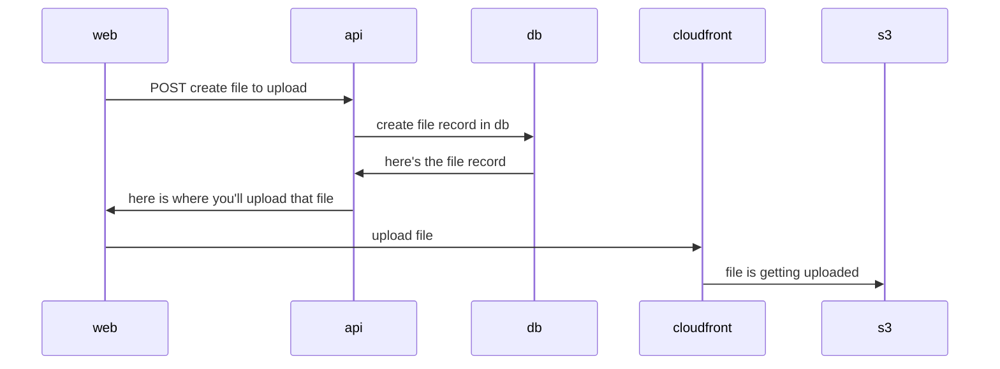
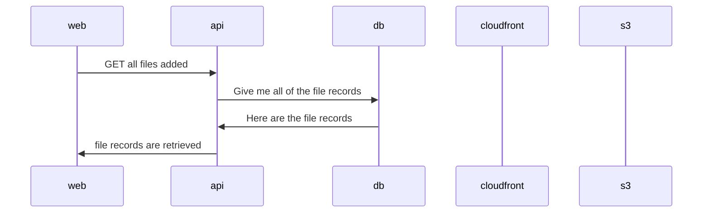

# Signed Things

The purpose of this project is to test out signed cookies/urls.

- [Signed Things](#signed-things)
  - [Project interactions](#project-interactions)
    - [Uploading a file](#uploading-a-file)
    - [Get all files](#get-all-files)
  - [Implementation](#implementation)
    - [App](#app)
      - [Database](#database)
      - [API](#api)
      - [Web](#web)
    - [Infrastructure](#infrastructure)
      - [S3](#s3)
      - [Cloudfront](#cloudfront)
  - [Things Learned](#things-learned)

## Project interactions

### Uploading a file

### Get all files

## Implementation

### App

#### Database

The database is just mongo db served from docker. It stores file records which consists of a unique id, name of the file, and it's location within S3

#### API

The API is an express server that handles all of the file [interactions](app/api/src/routers/files.ts). It is also responsible for doing the signing of the file url in S3 so that it can be viewed.

#### Web

### Infrastructure

The infrastructure was setup using terraform

#### S3

This [S3](https://aws.amazon.com/s3/) bucket was set up to be private and can only be accessed via [Cloudfront](#cloudfront)

#### Cloudfront

[Cloudfront](https://aws.amazon.com/cloudfront/) was used to be the entry point to the [S3](#s3) bucket and set up to use a signing group which is used to determine who can have [access](https://docs.aws.amazon.com/AmazonCloudFront/latest/DeveloperGuide/PrivateContent.html) to those files.

## Things Learned

