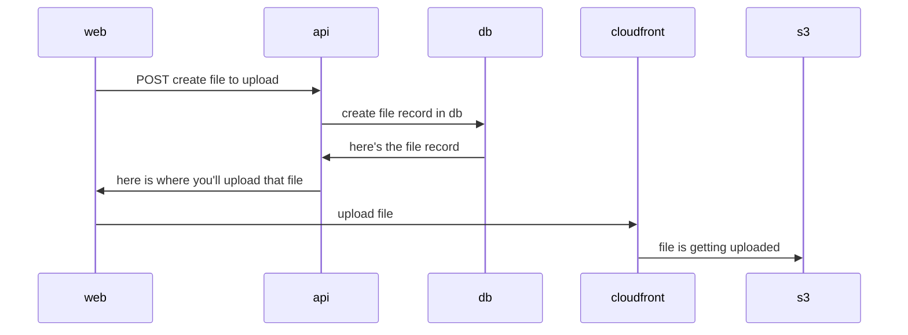
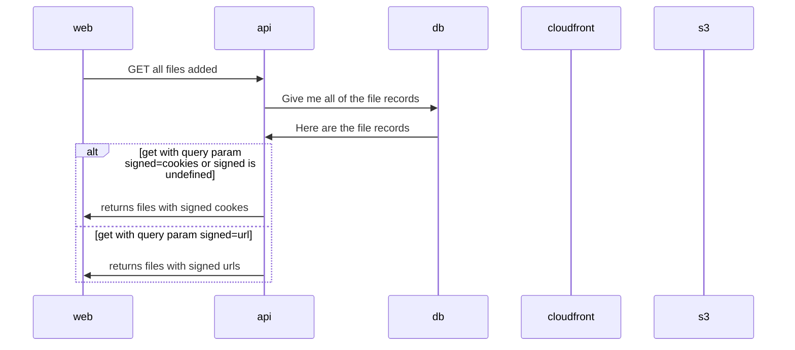

# Signed Things

The purpose of this project is to test out signed cookies/urls. I'm super tired right now so we'll see how this goes.

- [Signed Things](#signed-things)
  - [Project interactions](#project-interactions)
    - [Uploading a file](#uploading-a-file)
    - [Get all files](#get-all-files)

## Project interactions

### Uploading a file

### Get all files

